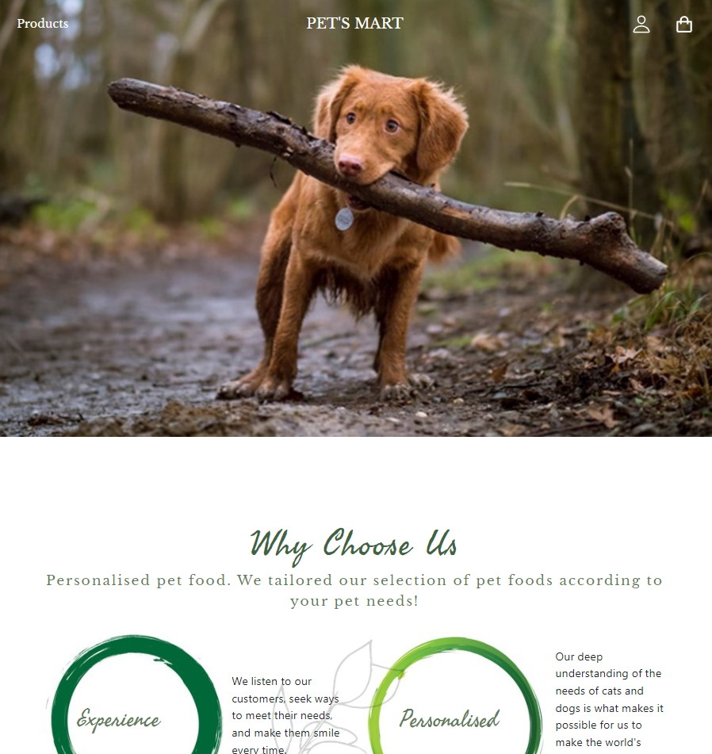

# PET's MART (NodeJS Backend)

## Introduction
This is a code repository for a personal fullstack project on ReactJS eCommerce web Pet Shop application.

The project implement a complete sample pattern for a real-life eCommerce web application including user login/logout, registration, landing page design, account information and shopping cart and store checkout flow.

### Landing Page

### Store design

### User Login/Logout & Registration

### Shopping Cart

## Built with
- ReactJS - Used to implement webpage logic, visuals and animations
- NodeJS - For server implementation at the backend
- GraphQL - API
- MongoDB - To store user information

## Prerequisite
- Download and install npm  
    A. sudo apt update\
    B. sudo apt install nodejs npm

- Download and install node version 15.6.0\
    A. npm install -g node@15.6.0

- Download and install MongoDB 

- Ensure that localhost port 3000, 5000 and 27017 are available

Note: Please ensure the node version installed is as specified & below version 17 (Important).

## Setup

1. Clone this repo onto your client machine
2. cd into server folder
3. npm install - To install the node modules in the server folder
4. cd into client folder
5. npm install - To install the node modules in the client folder

## Execution 

1. cd into server folder
2. node server.js - start API server on localhost 5000
3. Start Mongodb - DB will start on localhost 27017
4. cd into client folder
5. npm start - start react client on localhost 3000

